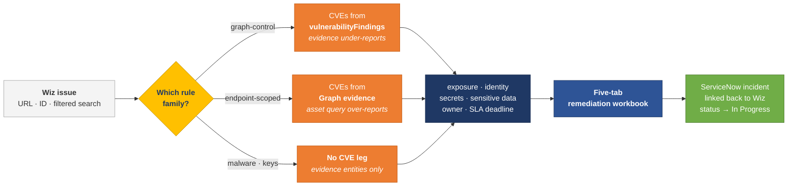
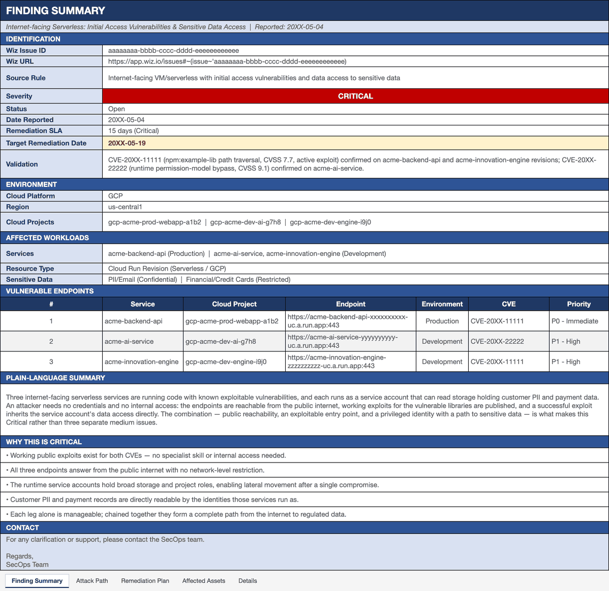
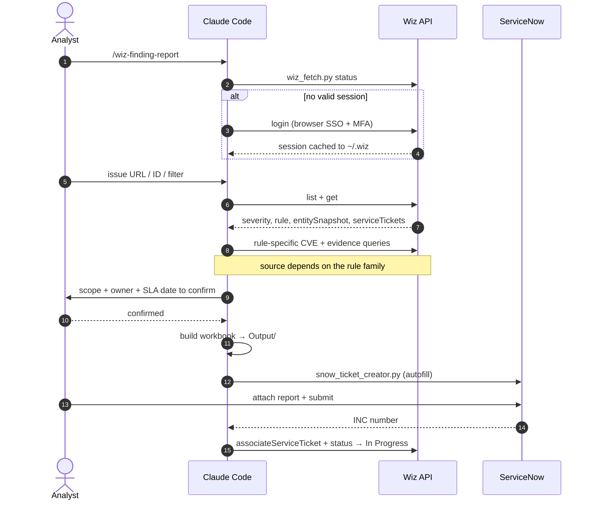

# Wiz Finding Report — Claude Code Skill


A [Claude Code](https://claude.ai/code) skill for the security team that has to turn Wiz findings into work somebody else can actually do.

**The problem.** A Wiz issue is written for the analyst who opens it, not for the team who has to fix it. It names a rule and a resource — it doesn't say which CVEs actually matter, how they chain together, who owns the workload, or when the fix is due. And the people who do the fixing usually have no Wiz access at all. So for every finding, an analyst sits down and works it out by hand: reading the Security Graph, chasing the owner through resource tags, computing the SLA date, writing it up, raising the ticket, linking it back. Slow, repetitive, and it has to be right.

**What this does.** One command produces the finished article — a five-tab workbook giving the CVEs in scope, the attack path they enable, prioritised remediation actions with a confirmed owner, and the target remediation date — then raises the ServiceNow incident and links it back to the Wiz issue. The remediation team can act on it without opening Wiz.

**Why it isn't just an export script.** The hard part was never the formatting; it's knowing which data to trust. The authoritative source for a finding's CVEs *depends on the Wiz rule*, and choosing the wrong one produces a report that looks complete but quietly isn't. That judgment is what the skill encodes — along with splitting a rule that spans many teams into one report per owner, recognising when an exposure is inherent to the service, and refusing to guess an owner it can't confirm. It also records what it learns, so the next report starts further ahead than the last.

---



---

## Sample output



Download the full five-tab workbook: **[`assets/sample_report.xlsx`](assets/sample_report.xlsx)**

Both are generated from synthetic data by `python scripts/build_report.py --demo`, so the published sample can never contain real finding data.

---

## Where the CVE truth comes from

This is the part that takes longest to learn and is easiest to get silently wrong. **The authoritative source for a finding's CVEs depends on the Wiz rule**, and using the wrong one produces a report that looks complete but isn't.

| Finding family | Named CVEs come from | Why the other source is wrong |
|---|---|---|
| **Graph-control / toxic combination**<br/>*"Internet-facing VM with initial access vulnerabilities and data access to sensitive data"* | `vulnerabilityFindings` filtered on `hasInitialAccessPotential: true` | The issue's `evidenceQueryResults` only *samples* attack paths, so it under-reports — one validated case showed 1 CVE in evidence vs 3 from the authoritative query |
| **Endpoint-scoped exposed software**<br/>*"Exposed vulnerable software on VM/serverless"* (+ its privileged variant) | The issue's `evidenceQueryResults` (`ENDPOINT → HOSTED_TECHNOLOGY → SECURITY_TOOL_FINDING`) | Exactly the opposite — asset-scoped `vulnerabilityFindings` over-reports every initial-access CVE anywhere on the container (one case: 5–8 library CVEs returned where Wiz showed a single endpoint-served one) |
| **Malware detection** | No CVEs — `MALWARE_INSTANCE` entities in evidence | These are static file-presence matches (hash reputation / YARA), not proof of execution. On offensive-security hosts they are usually the team's own tooling |
| **Cleartext storage-account keys** | No CVE leg at all — the rule has no vulnerability dimension | Three legs all come from evidence: public endpoint, the cleartext key, and the privileged storage target |

Exposure, identity, secret and sensitive-data context always comes from the Security Graph evidence; the CVE list is the part that flips. The full per-rule catalog — confirmed instances, each rule's evidence shape, and the reconciliation rules — lives in [`references/rule-catalog.md`](references/rule-catalog.md).

---

## How a report gets built



---

## Key capabilities

- **Zero-config auth** — opens your installed Edge/Chrome, you sign in via your IdP/SSO with MFA, session is cached locally. No API keys or service accounts needed.
- **Live API pull** — fetches the issue, CVEs, and Security Graph evidence directly from Wiz; no manual copy-paste from the UI.
- **Rule-aware CVE sourcing** — picks the authoritative source per rule family (see the table above) instead of applying one query everywhere.
- **Complete CVE sweep** — paginates the full `vulnerabilityFindings` dataset for the affected resource (a single VM can have 2,000+ raw findings), deduplicates by CVE ID, and scopes to the CVEs that actually trigger the finding.
- **Per-owner splitting** — one Wiz rule can span dozens of resources across many teams. A report carries one owner, one incident, one assignment group, so the skill groups by owning team and raises one report per group instead of an unactionable mega-report.
- **ServiceNow ticket awareness** — checks whether the issue already has a linked ticket before building, and asks for the original report date so the SLA clock starts on day one rather than today.
- **SLA-driven deadlines** — computes the exact Target Remediation Date (Date Reported + severity SLA) and highlights it amber, with an ⚠ OVERDUE label once it passes.
- **5-tab standardised format** — consistent structure every time, ready to share with a remediation team.
- **Incremental patching** — when updating an existing report, patches only the changed cells rather than rebuilding, preserving manual formatting the team has applied.

---

## Installation

> [!IMPORTANT]
> **Step 2 is the one that makes this work for _your_ organisation.** Nothing connects to Wiz or
> ServiceNow until `skill_config.json` exists. If a run fails with "No Wiz portal URL configured" or
> ends up pointing at the wrong ServiceNow instance, this is almost always why.

**Before you start**, have these to hand — they're what step 2 asks for:

| You'll need | Where to find it |
|---|---|
| Your IdP-initiated SSO link to Wiz | The bookmark/tile you normally click to reach Wiz (Okta / Entra ID / Ping) |
| Your Wiz tenant GraphQL endpoint | `https://api.<region>.app.wiz.io/graphql` — or leave blank, `login` captures it |
| Your ServiceNow base URL | `https://<your-org>.service-now.com` |
| A default assignment group | The group to route to when no owner can be confirmed |
| Python 3.x | `python --version` |

**1. Copy this folder into your Claude skills directory**

```bash
# macOS / Linux
cp -r wiz-finding-report ~/.claude/skills/wiz-finding-report

# Windows
xcopy /E /I wiz-finding-report "%USERPROFILE%\.claude\skills\wiz-finding-report"
```

The folder **must be named `wiz-finding-report`** — Claude uses the folder name to register the skill. This step comes first because the template you need next lives inside it.

**2. Configure your organisation settings** *(one-time, required)*

```bash
cd ~/.claude/skills/wiz-finding-report
cp templates/skill_config.example.json skill_config.json   # then edit the placeholders
```

Fill in your analyst name and email, the Wiz sign-in portal / API URL, and your ServiceNow instance URL and default assignment group. `skill_config.json` belongs at the **skill root** (next to `SKILL.md`), not inside `scripts/`.

**Prefer not to edit JSON by hand?** Just run the skill — its first-run setup collects these values interactively and writes the file for you. Either way `skill_config.json` is git-ignored, so your settings are never committed, and every later run reuses it.

**3. Install Python dependencies**

```bash
python -m pip install --user -r requirements.txt
```

Installs `openpyxl` (report generation) and `playwright` (browser-based auth). The Wiz API client itself is standard library only.

> **Corporate network note (Zscaler / TLS inspection):** do **not** run `playwright install` — corporate TLS interception breaks the bundled-browser download. The scripts drive your already-installed Edge or Chrome instead.

---

## Quick start

Open Claude Code in your working directory and type:

```
/wiz-finding-report
```

Claude will guide you through:

1. **Session check** — reuses a cached Wiz session if valid; otherwise walks you through browser SSO.
2. **Finding lookup** — paste a Wiz issue URL or ID, or describe a filter (*"show me open Critical issues in the payments project"*).
3. **Ticket check** — inspects `serviceTickets`. If a ticket exists, Claude asks for the original report date so the SLA is correct; if not, today's date is used silently.
4. **Scope confirmation** — Claude shows what it found, including the derived owner, and asks before building.
5. **Report generation** — saves an `.xlsx` workbook to an `Output/` subfolder in your working directory.
6. **Ticket association** — offers to link a ServiceNow ticket back to the Wiz issue via the API.

---

## Authentication

| Option | Best for | Setup |
|--------|----------|-------|
| **Browser SSO** *(recommended)* | Anyone with IdP/SSO access | Claude opens Edge/Chrome, you sign in, press ENTER — session cached in `~/.wiz/` |
| **API token** | Personal Wiz token | Set `WIZ_API_TOKEN` + `WIZ_API_URL` as environment variables |
| **Service account** | Shared / CI use | Set `WIZ_CLIENT_ID`, `WIZ_CLIENT_SECRET`, `WIZ_API_URL` (Wiz → Settings → Access Management → Service Accounts; scopes: `read:issues`, `read:resources`, `read:vulnerabilities`) |

Sessions persist in `~/.wiz/browser-profile`, so re-auth after expiry is usually a single SSO click. Some tenants authenticate the GraphQL endpoint with a bearer token and others with an httpOnly session cookie — `login` detects which and records it.

**Re-authenticate:** `./scripts/login.sh` (macOS/Linux), double-click `scripts\login.bat` (Windows), or `python scripts/wiz_fetch.py login`.

### TLS behaviour

Requests verify certificates. If the certificate is rejected — the normal case behind a TLS-inspecting proxy — the request is retried once with verification disabled and a warning on stderr, so it works on a corporate network without being silently insecure everywhere else.

| Variable | Effect |
|---|---|
| *(unset)* | Verify; on a certificate error, warn once and retry unverified |
| `WIZ_VERIFY_SSL=1` | Strict — fail on a bad certificate, never fall back |
| `WIZ_INSECURE_SSL=1` | Skip the verified attempt entirely (no warning) |

---

## Report structure

| Tab | Contents |
|-----|----------|
| **Finding Summary** | Identification (Issue ID, severity badge, SLA, Target Remediation Date), Environment, Affected Workload, Vulnerable Endpoints, plain-language Summary, Why this severity, Contact block |
| **Attack Path** | Step-by-step exploit chain — stage, what happens, and the control that breaks the chain at each step |
| **Remediation Plan** | Prioritised actions (P0 - Immediate / P1 - High / P2 - Medium) with affected resources, recommended actions, suggested owners, and status |
| **Affected Assets** | Every in-scope resource with full identifiers, cloud console URLs, region, and notes |
| **CVE Details** *(when applicable)* | Full deduplicated CVE list for vulnerability-heavy findings |
| **Details** | Trimmed Wiz source export — the audit trail, populated columns only, goes last |

### Remediation SLA — set it to your own policy

Remediation windows are your organisation's policy, not this skill's. The values below are **defaults, shown so there is something sensible out of the box** — set `sla_days` in `skill_config.json` to whatever your vulnerability-management standard says, and every Target Remediation Date follows from it.

| Severity | Days to remediate *(default)* |
|----------|:-----------------:|
| URGENT   | 5  |
| CRITICAL | 15 |
| HIGH     | 30 |
| MEDIUM   | 60 |
| LOW      | 120 |

```jsonc
// skill_config.json — e.g. if your standard gives HIGH findings 45 days
"sla_days": { "URGENT": 5, "CRITICAL": 15, "HIGH": 45, "MEDIUM": 90, "LOW": 180 }
```

Severities you don't use can be left out. The **Target Remediation Date** (Date Reported + SLA) is highlighted amber in the workbook, with an ⚠ OVERDUE label once the deadline passes.

---

## ServiceNow integration

**Ticket-aware SLA calculation.** Before building, the skill queries `serviceTickets` on the issue. If a ticket is already linked it asks for the original report date, so the SLA clock starts then rather than today — this prevents artificially generous deadlines on findings raised weeks ago.

**Incident auto-fill.** `scripts/snow_ticket_creator.py` reads `Output/snow_ticket_pending.json` (written by the report workflow), opens ServiceNow in a persistent browser profile, resolves caller / assignee / group sys_ids through the in-page REST API, and fills the form. You attach the report and submit; the script captures the INC number and persists it to `Output/snow_ticket_result.json` so it survives the browser closing.

Assignment Group is derived from the assignee's actual group membership, never forced to a default — setting a group the assignee doesn't belong to makes ServiceNow silently clear the Assigned To field.

**Associating the ticket.** After delivery the skill offers to link the ticket to the Wiz issue: it re-checks `serviceTickets` to avoid duplicate links, calls `associateServiceTicket`, then moves the issue to In Progress.

---

## Scope & safety

- **Read-only against Wiz, with two exceptions** — the skill only ever writes via `associateServiceTicket` (link a ticket) and `updateIssue` (set status to In Progress), both after explicit confirmation. It never suppresses, resolves or deletes a finding.
- **Credentials stay local** — the session cred is cached to `~/.wiz/token.json` with `0600` permissions and is never printed; `status` reports only endpoint, auth mode and expiry. Long-lived service-account credentials belong in environment variables, not on disk.
- **Generated reports are git-ignored** — `Output/` holds real hostnames, CVEs and owner emails. It is excluded from version control by design; `assets/` holds only the synthetic demo.
- **No commands in deliverables** — remediation guidance states *what* to change ("upgrade the library to a fixed release ≥ x.y") rather than pasting shell commands, because the target environment is rarely known and a copy-paste command in a production change ticket is a liability.
- **Ownership is never guessed** — if the technical owner can't be confirmed from resource tags or a prior incident, the report says "To be confirmed" and the ticket routes to a triage group rather than naming someone speculatively.

---

## Repository layout

```
wiz-finding-report/
├── SKILL.md                          instructions Claude Code loads — must stay at root
├── README.md                         this file
├── LICENSE                           MIT
├── CHANGELOG.md                      dated audit trail of learned patterns
├── requirements.txt                  openpyxl, playwright
│
├── references/                       read on demand, never preloaded
│   ├── rule-catalog.md                 which source is authoritative per Wiz rule family
│   └── graphql-notes.md                schema quirks, filter typing, mutation shapes
│
├── scripts/                          everything executable
│   ├── wiz_fetch.py                    Wiz GraphQL client: login/status/list/get/raw
│   ├── build_report.py                 reference 5-tab builder; --demo regenerates the sample
│   ├── snow_ticket_creator.py          ServiceNow incident auto-fill (Playwright)
│   ├── login.sh / login.bat            re-authenticate with Wiz
│   └── snow_create_ticket.sh / .bat    run the ServiceNow auto-fill
│
├── templates/                        copy these out; don't edit in place
│   ├── skill_config.example.json       → skill_config.json at the repo root
│   └── Asset_Owner_Registry.example.md → your local asset → owner registry
│
└── assets/                           synthetic demo only
    ├── sample_report.png
    └── sample_report.xlsx
```

Two paths are created at runtime and deliberately kept out of version control:
**`skill_config.json`** at the root (your organisation's settings) and **`Output/`** in whatever
directory you run the skill from (generated reports, which contain real finding data).

---

## Customising it for your organisation

Nothing organisation-specific is baked into the skill's instructions. Everything that varies between teams lives in `skill_config.json`, so you adapt the skill by editing config — not by forking `SKILL.md`:

| What | Config key | Default |
|---|---|---|
| Team name used in deliverables | `report.team_name` | `SecOps Team` |
| Contact line at the end of Finding Summary | `report.contact_line` | *"For any clarification or support…"* |
| Sign-off on reports and tickets | `report.sign_off` | `Regards,\nSecOps Team` (set `""` to omit) |
| **Remediation SLA days per severity** | `sla_days` | 5 / 15 / 30 / 60 / 120 |
| Fallback ServiceNow assignment group | `servicenow.default_assignment_group` | `Vulnerability_Management` |
| Workbook author metadata | `analyst.report_author` | — |

The SLA row matters most: it drives every Target Remediation Date. If your policy gives HIGH findings 45 days rather than 30, change one number and every future report follows.

### How it learns

The skill improves by **writing lessons back into its own files** at the end of a session — there's no hidden model training, and nothing changes behind your back. The distinction it follows:

- **A correction to a _value_** — "we sign off as the Cloud Security Office", "our HIGH SLA is 45 days" — goes into `skill_config.json`, which is yours alone and git-ignored.
- **A correction to a _rule or convention_** — "never paste shell commands into a ticket", "always state the exposure is inherent when the port is required" — goes into `SKILL.md`'s hard rules, or into `references/` if it's rule-family or schema detail.
- **A confirmed owner** goes into your local `Asset_Owner_Registry.md`.
- **Anything dated** is appended to `CHANGELOG.md`, which is why that file reads as an operational history rather than a release log.

So in practice: tell it "don't sign off like that, we use X" and it should update your config and confirm which file it changed. If it hard-codes your wording into `SKILL.md` instead, that's a bug — the whole point is that the instructions stay shareable while your values stay local.

---

## Extending it

The skill is designed to accumulate knowledge rather than be rewritten:

- **A new Wiz rule family** → add an entry to `references/rule-catalog.md` recording the rule ID, which legs the evidence carries, where its CVEs come from, and what actually closes the finding.
- **A new schema quirk** → add it to `references/graphql-notes.md` with the date you confirmed it.
- **A convention or correction** → add it to the Hard rules or Styling sections of `SKILL.md`.
- **Anything dated** → note it in `CHANGELOG.md`.

Keep `SKILL.md` lean; it loads on every invocation, so situational detail belongs in `references/`.

---

## Troubleshooting

| Symptom | Fix |
|---------|-----|
| Edge window opens and immediately closes | Edge was already running and handed off the URL — close all Edge windows first, or use `--channel chrome` |
| `PermissionError` when saving the report | The `.xlsx` is open in Excel; close it and retry |
| `401 Unauthorized` during fetch | Session expired — re-run `python scripts/wiz_fetch.py login` |
| `playwright` not found | `python -m pip install --user playwright` (do **not** run `playwright install`) |
| TLS warning on every request | Expected behind a TLS-inspecting proxy. Set `WIZ_INSECURE_SSL=1` to silence it, or install your proxy's CA into the trust store to fix it properly |
| `GraphQL HTTP 400` with a field error | Your tenant's schema may not expose that field — the error names it; trim it and record the difference in `references/graphql-notes.md` |
| Borders look missing in the workbook | Border colour must be 8-hex ARGB `FF000000`; a 6-hex `000000` serialises as fully transparent |

---

## License

MIT — see [LICENSE](LICENSE).
